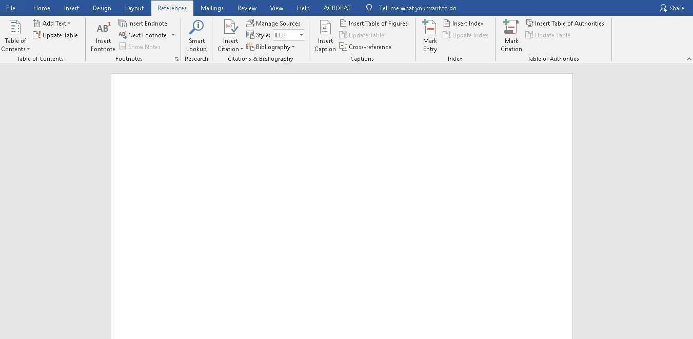
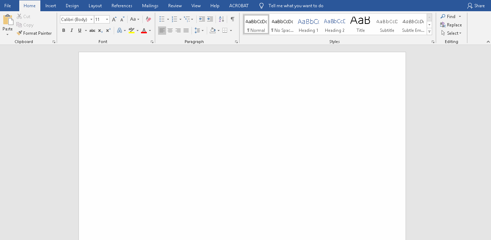
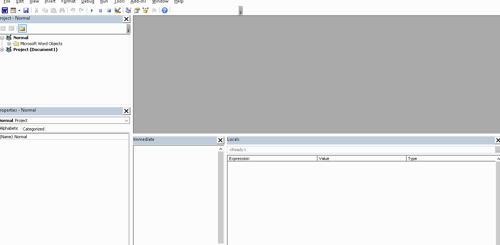
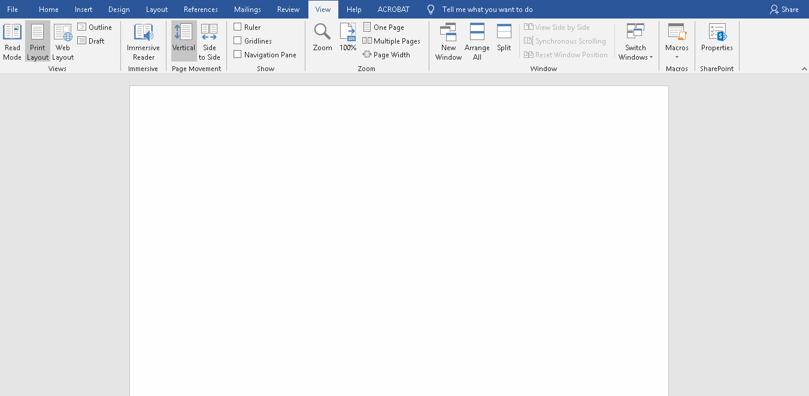

## WordBibTex
Este projeto tem como objetivo fornecer uma alternativa para importação de citações ou bibliotecas no formato BibTex diretamente para o MS Word. O editor de texto do Windows, já possuiu um sistema de citações, entretanto, somente suporta bibliotecas no formato XML específico.
Inicialmente a ferramenta de importação de BibTex será disponibilizada, e posteriormente, a opção de consulta de DOI, ISSN, ISBN e até mesmo consultas indiretas por autores, livros e artigos.

### Importação de bibliotecas
A ferramenta de importação possibilita, inserir uma citação única, corrigir a citação antes da importação e inserção em massa.

### Instalação
Para a instalação, faça download dos arquivos e extraia em uma pasta conhecida, em seguida importe os macros para o arquivo _"Normal.dot" do MS Word_.
Acessando o editor de macro.

Importando os macros.

### Utilizando
Vá até a lista de macros e execute _*"WordBibTex"*_

### Todo
- [x] Interface para importação de arquivos BibTex
- [x] Disponibilizar no GitHub em Pt-BR.
- [ ] Disponibilizar no GitHub em En-Us.
- [ ] Verificar compatibilidade com versão diversas de BibTex.
- [ ] Realizar teste complexos e tratar erros.
- [ ] Inserir busca / consulta por DOI
- [ ] Inserir busca / consulta por ISBN
- [ ] Integrar com Google Books, Google Schoolar e outras plataformas.
- [ ] Permitir inserção direta de arquivos.
- [ ] Permitir exportação da biblioteca do MS Word em formato BibTex.
